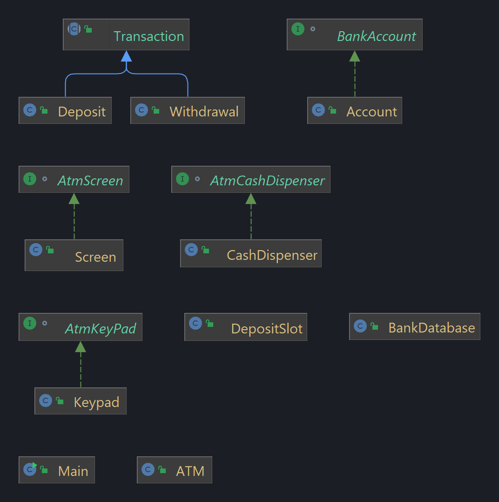

# ATM Project (Case study-2)

## Table of contents

- [Overview](#overview)
    - [Problem Statement](#problem-statement)
    - [Solution](#solution)
        - [OOP Concepts and their implementation](#oop-concepts-and-their-implementation)
        - [Classes and methods](#classes-and-methods)

## Overview

### Problem Statement

A local bank intends to install a new automated teller machine(ATM) to allow users (i.e.,bank
customers) to perform basic financial transactions. Each user can have only one account of
each type(savings,IB etc.,.) at the bank. ATM users should be able to view their account
balance, withdraw cash(i.e., take money out of an account ) and deposit funds(i.e.,place money
into an account) etc.

The user interface of the automated teller machine contains the following hardware
components:

- a screen that displays messages to the user
- A keypad that receives numeric input from the user
- A cash dispenser that dispenses cash to the user and
- A deposit slot that receives deposit envelopes from the user.

The cash dispenser begins each day loaded with a certain amount. [Note: certain elements of
the ATM described here do not accurately mimic those of a real ATM. For example, a real ATM
typically contains a device that reads a user’s account number from an ATM card, whereas this
ATM asks the user to type an account number using the keypad. A real ATM also usually prints
a receipt at the end of a session, but all output from this ATM appears on the screen].

The bank wants you to develop software to perform the financial transactions initiated by bank
customers through the ATM. The bank will integrate the software with the ATM’s hardware at a
later time. The software should encapsulate the functionality of the hardware devices (e.g.,cash
dispenser, deposit slot) within software components ,but it need not concern itself with how
these devices perform their duties.The ATM hardware has not been developed yet,so instead of
writing your software to run on the ATM,you should develop a first version of the software to run
on a personal computer. This version should use the computer’s monitor to simulate the ATM’s
screen,and the computer’s keyboard to simulate the ATM’s keypad.

### Solution

#### OOP Concepts and their implementation

- **Encapsulation** : Encapsulation is the process of binding the data and the functions that
  operate on that data together. In other words, encapsulation is the mechanism that binds
  together code and the data it manipulates, and keeps both safe from outside interference and
  misuse. Encapsulation is used to hide the values or state of a structured data object inside a
  class, preventing unauthorized parties' direct access to them. Encapsulation can be achieved by: Declaring all the
  variables in the class as private and writing public methods in the class to set and get the values of variables. In
  this way we can achieve data hiding.
    - **Implementation** : In this project, I have used encapsulation to hide the data and the
      functions that operate on that data. I have used private variables and public methods to
      access the private variables in most classes in this project. For example, in the class `Account` I have used
      private variables to store the account number and balance of the account. I have used public methods to access the
      private variables. I have used the same concept in other classes as well.
- **Abstraction** : Abstraction is the process of hiding the implementation details and showing only
  functionality to the user. In other words, the user will have the information on what the object
  does instead of how it does it. Abstraction can be achieved with either abstract classes or interfaces.
    - **Implementation** : In this project, I have used abstraction to hide the implementation
      details and show only the functionality to the user. I have used abstract classes and interface to achieve
      abstraction. For eg : I have made an interface called AtmCashDispenser which has a method called `dispenseCash()`.
      I have then implemented this interface in the class `CashDispenser`. I have used the same concept in other classes
      as well(`BankAccount`, `AtmKeyPad`, `AtmScreen` are interfaces which are implemented by me in different classes).
    ```java
    interface AtmCashDispenser {
    void dispenseCash(int amount);
    }
    
    public class CashDispenser implements AtmCashDispenser {}
    ```
- **Inheritance** : Inheritance is the process by which objects of one class acquire the properties of
  objects of another class. Inheritance provides code reusability.
    - **Implementation** : In this project, I have used inheritance to acquire the properties of
      objects of another class. I have used inheritance to extend the functionality of the classes. For eg : I have made
      a general purpose abstract class `Transaction` which has a method called `execute()`. I have then extended this
      class in the classes `Deposit`, `Withdraw`, to `execute` the transaction in corresponding ways.
- **Polymorphism** : Polymorphism is the ability of an object to take on many forms. We have two
  types of polymorphism in Java: compile-time polymorphism and runtime polymorphism. We use
  method overloading and method overriding to achieve polymorphism in Java.
    - **Implementation** : In this project, I have used polymorphism to achieve compile-time
      polymorphism. I have used method overloading to achieve polymorphism. For eg : I have made a method called
      `displayMessageLine()` in the class `AtmScreen`. I have then overloaded this method to display different messages
      in the class.
  ```java
  public class Screen implements AtmScreen {
    public void displayMessageLine(String message) {
        System.out.println(message);
    }
    public void displayMessageLine(int message) {
        System.out.println(message);
    }

    public void displayMessageLine(double message) {
        System.out.println(message);
    }
  }
    ```

#### Classes and methods



- **Main** : This is the main class which contains the main method. This class is responsible for
  creating the objects of the other classes and calling the methods of those classes.
- **ATM** : This class contains the methods to perform the operations of the ATM. This class
  contains the methods to display the menu, to get the user input, to perform the operations
  according to the user input, etc.
- **Account** : This class contains the methods to perform the operations of the account. This
  class contains the methods to get the account number, to get the account balance, to deposit
  money, to withdraw money, etc.
- **CashDispenser** : This class contains the methods to perform the operations of the cash dispenser.
  This class contains the methods to get the cash dispenser balance, to dispense cash, etc.
- **DepositSlot** : This class contains the methods to perform the operations of the deposit slot. This
  class contains the methods to deposit cash.
- **Keypad** : This class contains the methods to perform the operations of the keypad.
- **Screen** : This class contains the methods to perform the operations of the screen.
- **BankDatabase** : This class contains the methods to perform the operations of the bank database.
  This class contains the methods to get the account number, to get the account balance, to
  deposit money, to withdraw money, etc.
- **Transaction** : This class contains the methods to perform the operations of the transaction.
- **Withdrawal** : This class contains the methods to perform the withdrawal operation.
- **Deposit** : This class contains the methods to perform the deposit operation.